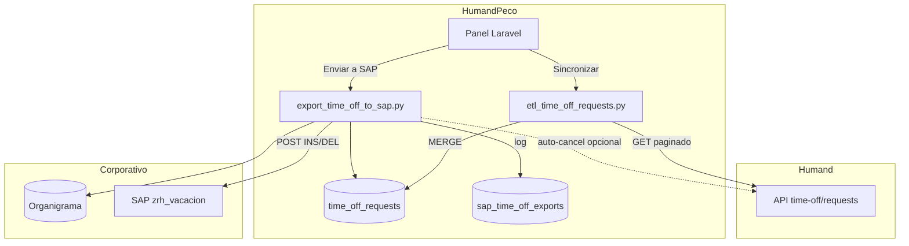

# Arquitectura y funcionamiento

## Propósito

**HumandPeco** es un middleware que:

1. **Sincroniza** solicitudes de tiempo libre desde Humand hacia SQL Server.
2. **Exporta** a SAP las solicitudes aprobadas o canceladas (según reglas).
3. **Muestra** un panel web para consultar solicitudes y el log de envíos a SAP.

Los empleados piden vacaciones en **Humand**; esta plataforma las refleja en **SAP** con trazabilidad.

## Diagrama de flujo

## ETL (Humand → BD)

**Script:** `scripts/etl_time_off_requests.py`

- Llama `GET /time-off/requests` con paginación (`page=1,2,3…`).
- Filtros opcionales vía URL o argumentos CLI:
  - `policyTypeIds` — por política (LEGO, Vacaciones FC, etc.)
  - `states`, `fromDate`, `toDate`, `createdAtSince`, `limit`
- Por cada solicitud guarda en `time_off_requests`:
  - `request_id`, empleado, `policy_name`, `policy_type_id`
  - fechas, días, `state`, `step_state`, descripción

**Disparadores:**

- Botón **Sincronizar** en el panel (por política).
- Tarea programada externa (Task Scheduler / SQL Agent) ejecutando el mismo script.

No recorre empleados uno a uno: Humand devuelve un **listado de solicitudes** ya armado.

## Exportación (BD → SAP)

**Script:** `scripts/export_time_off_to_sap.py`

1. Lee `time_off_requests` con estado `APPROVED` o `CANCELLED` (configurable).
2. Cruza con `Organigrama.dbo.Organigrama` para obtener `CodigoCol` (número de personal SAP).
3. Mapea política → clave SAP:
   - `VACACIONES FC` → `6072`
   - `LEGO` → `6073`
4. Acciones:
   - **INS** — solicitud aprobada (insertar en SAP)
   - **DEL** — solicitud cancelada, solo si antes hubo un APPROVED exitoso en SAP
5. Registra resultado en `sap_time_off_exports`.

Si SAP responde que el día «es libre», puede **cancelar automáticamente** la solicitud en Humand (`HUMAND_AUTO_CANCEL`).

## Tablas principales

### `time_off_requests`

Copia local de solicitudes Humand (origen del export).

| Campo relevante | Descripción |
|-----------------|-------------|
| `request_id` | PK, ID Humand |
| `issuer_employee_internal_id` | Correo / ID interno |
| `policy_type_id` | ID Humand (ej. 172701, 9637) |
| `policy_name` | Nombre visible (LEGO, VACACIONES FC) |
| `state` | APPROVED, CANCELLED, IN_PROGRESS, REJECTED, … |
| `step_state` | Paso del workflow (PENDING, APPROVED) |

### `sap_time_off_exports`

Log de cada intento de envío a SAP (éxito, error, URL, respuesta).

## Políticas configuradas

Definidas en `config/time_off_policies.php` y `.env`:

| Slug | Nombre | policyTypeId Humand |
|------|--------|---------------------|
| `lego` | LEGO | 172701 |
| `vacaciones-fc` | Vacaciones FC | 9637 |

Cada pantalla del menú **Solicitudes** sincroniza **solo su política**.

## Estados de solicitud (Humand)

| `state` | ¿Va a SAP? |
|---------|------------|
| APPROVED | Sí → INS |
| CANCELLED | Sí → DEL (si hubo APPROVED OK previo) |
| IN_PROGRESS, PENDING, REJECTED | No (solo consulta en panel) |

## Autenticación del panel

- **Producción:** Hub corporativo + usuario en BD `Organigrama` con rol Vacaciones (4) o Nóminas (5).
- **Local (`APP_ENV=local`):** acceso simplificado para desarrollo.

## Rutas web relevantes

| Ruta | Nombre |
|------|--------|
| `/solicitudes/lego` | Panel LEGO |
| `/solicitudes/vacaciones-fc` | Panel Vacaciones FC |
| `/solicitudes/{policy}/run-etl` | POST — ejecutar ETL |
| `/vacaciones/estatus` | Log SAP |
| `/vacaciones/run-export-sap` | POST — exportar pendientes |
